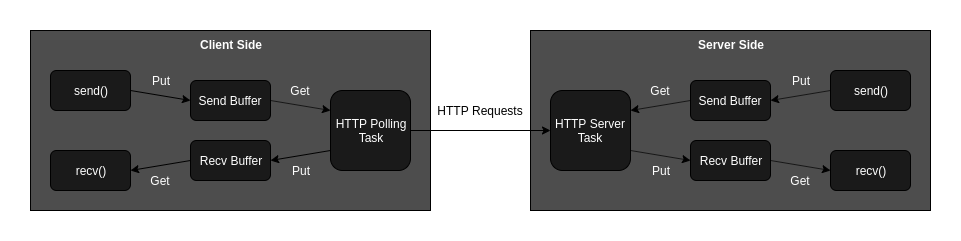

# httptunneling - A Python3 Library For Bidirectional Communication via HTTP(S) Tunneling

**httptunneling** is a simple and robust Python3 library that enables bidirectional and transparent communication between two hosts (or more) using HTTP tunneling: one of the hosts acts as an HTTP server, and the other acts as an HTTP client exchanging information with the server in real-time through polling.

This library supports HTTPS and allows customization of various parameters (as detailed below).

This library provides high resilience to service disruptions and failed connections, ensuring excellent reliability in data transmission and reception.

Each host (client or server), when required to send multiple data, places them in a buffer that functions as a queue. The queue is dequeued only if the transmission is successful (TCP connection of a single HTTP request/response must be correctly closed). In case of failure, the data chunk is retransmitted.

The communication behaves like a **continuous stream** (similar to a single TCP connection), so depending on how you want to use it, you need to implement your own application protocol on top of it.

### - Prerequisites

This library requires **requests** installed.
```
$ pip install requests
```

### - Usage

After installing `requests` as a dependency, simply place the `httptunneling.py` file into your project (or you can install it as a global library) and import it.
```python
import httptunneling
```

### - Examples

`client.py`
```python
import httptunneling

# initialize client
client = httptunneling.HttpTunnelingSocketClient('127.0.0.1', 8080)

# send some data to server. send are no blocking
client.send('Hello World!')    # send b'Hello World!'
client.send(3.1416)            # send b'3.1416'
client.send({'a': 1, 'b': 2})  # send b"{'a': 1, 'b': 2}"

# recv are blocking
data = client.recv(32)  # wait until 32 bytes are received
```

`server.py`
```python
import httptunneling

# initialize server
server = httptunneling.HttpTunnelingSocketServer(8080)

# send are no blocking
server.send('Hello!')    # send b'Hello World!'

# recv are blocking
data = server.recv(34) # wait until 34 bytes are received
print(data)            # print b"Hello World!3.1416{'a': 1, 'b': 2}"
```

### - Datasheet

- `HttpTunnelingSocketBase` class:
    - `send(self, data)` :
        - `data`: The data to be sent. Any type is allowed: if it is not binary it will be converted to string and then to binary with UTF-8 encoding.
    - `recv(self, size)` : 
        - `size`: The size of data to be received.

- `HttpTunnelingSocketClient` class (inherits from `HttpTunnelingSocketBase`):
    - `__init__(self, rhost, rport, polling_delta_time=0.1, ssl=False, uri='/', chunk_size=1024, http_request_timeout=8)` : 
        - `rhost`: The remote host to connect to.
        - `rport`: The remote port to connect to.
        - `polling_delta_time`: The time interval (in seconds) at which the send/receive buffer is checked. Default is 0.1 second.
        - `ssl`: Boolean parameter to indicate whether to use SSL for the connection: True use https, False use http. Default is False.
        - `uri`: The URI for the HTTP request. Default is '/'.
        - `chunk_size`: The size of data chunks to be sent/received in HTTP packets. Default is 1024 bytes.
        - `http_request_timeout`: The timeout duration (in seconds) for the HTTP request. Default is 8 seconds.
    - `management_task(self)` : Task to manage HTTP(S) polling. Internal use.

- `HttpTunnelingSocketServer` class (inherits from `HttpTunnelingSocketBase`):
    - `__init__(self, lport, lhost='', chunk_size=1024, http_request_timeout=8)` : 
        - `lport`: The local port to listen on.
        - `lhost`: The local host to bind the server to. Default is '' (all interfaces).
        - `chunk_size`: The size of data chunks to be sent/received in HTTP packets. Default is 1024 bytes.
        - `http_request_timeout`: The timeout duration (in seconds) for the HTTP request. Default is 8 seconds.
    - `management_task(self)` : Task to manage HTTP server. Internal use.



Note:
 - `chunk_size` and `rport`/`lport` must be the same in all host involved in communication.
 - It's best not to run `HttpTunnelingSocketClient` and `HttpTunnelingSocketServer` in the same script.
 - Send and receive are asymmetric as operation, so if you want send and receive data in real time and manage it simultaneously you must do it in separated threads: one thread for sending and one thread for receiving (see random_stream examples).

### - Usage in HTTPS

To use this library in HTTPS:

 - The host acting as the client must initialize `HttpTunnelingSocketClient` with `ssl=True`.
 - The host acting as the server should be behind a reverse proxy (such as nginx) responsible for handling HTTPS communication. The domain and certificates must be properly configured.
 - If you wish to bypass certificate verification, simply modify the `HttpTunnelingSocketClient` class at line 90 and add the `verify=False` parameter to `requests.post` call.